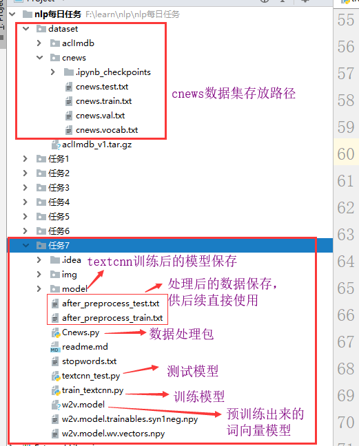
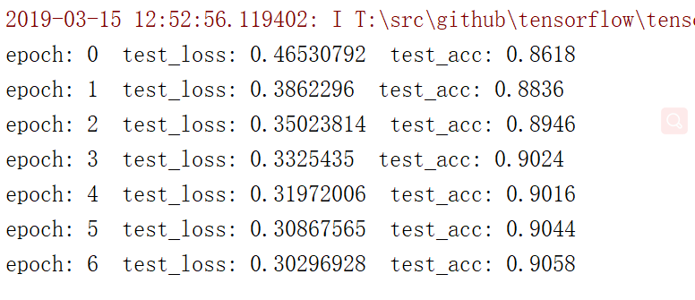
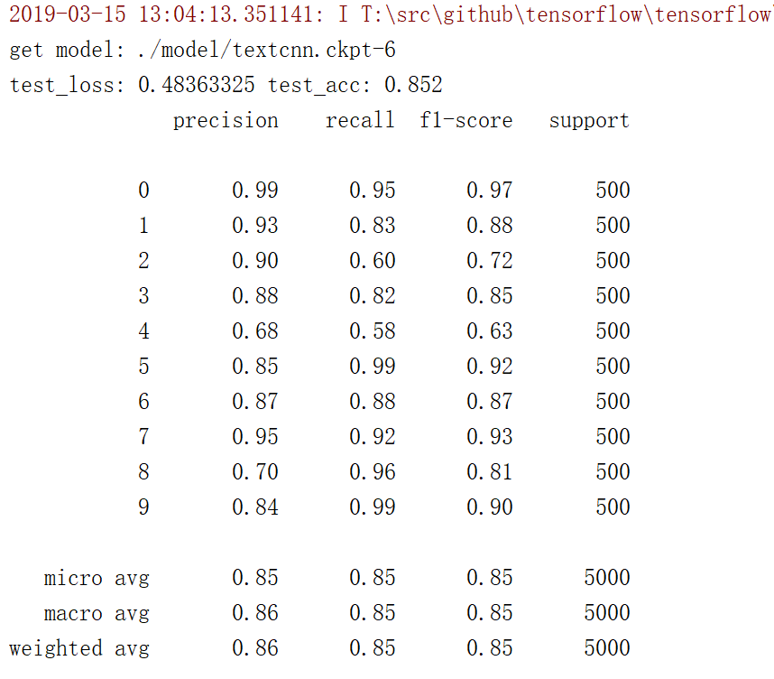

## 任务7：

1. 卷积运算的定义、动机（稀疏权重、参数共享、等变表示）。一维卷积运算和二维卷积运算。
2. 反卷积(tf.nn.conv2d_transpose)
3. 池化运算的定义、种类（最大池化、平均池化等）、动机。
4. Text-CNN的原理。
5. 利用Text-CNN模型来进行文本分类。

卷积种类参考：https://zhuanlan.zhihu.com/p/57575810

TextCNN模型原理参考：https://www.cnblogs.com/bymo/p/9675654.html

### TextCNN模型：

第一层：将词以词向量来进行表达。或者自定义个embedding同时加入到网络中训练

第二层：卷积层，共采用6个卷积核，分别大小为2*(n, d)，n=2,3,4。n为卷积长度(同一时刻，加入卷积运算的单词个数),d为词向量长度。

第三层：池化层，卷积层过后生成6个向量，每个向量的维度：seq_len - k_size +1。池化核大小等同向量维度，就是取各向量中的最大值。

第四层：组合6个池化后的值，形成一个向量。

第五层：全连接输出层，直接输出类别个数。

最后就可以通过softmax进行分类，计算损失，训练等操作

特征：这里用的是**词向量**表示方式

- **数据量较大**：可以直接随机初始化embeddings，然后基于语料通过训练模型网络来对embeddings进行更新和学习。

- **数据量较小**：可以利用外部语料来预训练(pre-train)词向量，然后输入到Embedding层，用预训练的词向量矩阵初始化embeddings。（通过设置weights=[embedding_matrix]）。

- - **静态(static)方式**：训练过程中不再更新embeddings。实质上属于迁移学习，特别是在目标领域数据量比较小的情况下，采用静态的词向量效果也不错。（通过设置trainable=False）
  - **非静态(non-static)方式**：在训练过程中对embeddings进行更新和微调(fine tune)，能加速收敛。（通过设置trainable=True）

作业代码目录结构：

训练过程的损失和精度：

在测试集的预测结果：

以上用的是预先训练的词向量，感觉效果好像一般。可以试试不用预先的词向量，然后加嵌入层看看结果如何。